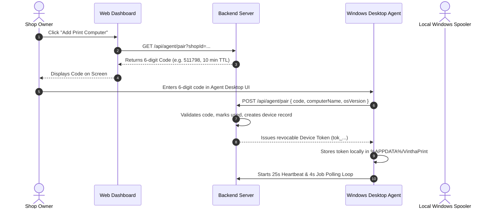

# System Architecture & Technical Blueprint
> **Vintha Print Platform**

---

## 1. Architectural Principles

1. **Zero Browser-USB Dependency:** Modern web browsers deliberately block direct silent access to local USB hardware for security reasons. All automatic printing is brokered via the paired **Vintha Print Agent** running locally on the shop computer.
2. **Deterministic Server Pricing:** The customer browser submits user preferences (page range, copies, color, duplex). The server performs 100% of the pricing arithmetic and snapshot generation. Client-submitted prices are discarded.
3. **No Unpaid Print Jobs:** A print job can NEVER transition to `QUEUED` until independent server-to-server payment verification (PhonePe callback or signed webhook) succeeds.
4. **Tenant Isolation:** Every shop owner and staff member is strictly bounded to their own shop resources through Supabase Row-Level Security (RLS) policies and tenant-aware queries.
5. **Private Storage & Timed Shredding:** Customer documents are stored in private storage buckets with random object names. Public direct URLs are prohibited. Files are automatically shredded after the configured retention window (default 24h).

---

## 2. Component Topology

```
+---------------------------------------------------------------------------------+
|                                 CUSTOMER TIER                                   |
|  - Mobile Smartphone Browser (No account required)                             |
|  - Progressive Web App (PWA)                                                   |
|  - Camera QR Scanner -> /shop/{slug} -> Upload -> Pricing -> PhonePe -> Live Track |
+---------------------------------------------------------------------------------+
                                      |
                                      | HTTPS / WebSocket
                                      v
+---------------------------------------------------------------------------------+
|                              CLOUD WEB TIER (apps/web)                          |
|  - Next.js 14 App Router on Vercel                                              |
|  - Customer Public Interface (/shop/[slug], /order/[id])                       |
|  - Shop Owner / Staff Dashboard (/dashboard/*)                                  |
|  - Platform Superadmin (/admin)                                                |
|  - REST APIs (/api/orders, /api/pricing, /api/agent/*, /api/payments/*)         |
+---------------------------------------------------------------------------------+
          |                                      |                     |
          | PhonePe Server API                  | Supabase Client     | S3 / Private Storage
          v                                      v                     v
+-----------------------+              +--------------------+   +-------------------+
|  PHONEPE PAYMENT GW   |              | SUPABASE POSTGRES  |   | PRIVATE BUCKET    |
| - Standard Checkout   |              | - 24 Tables        |   | - Random Object   |
| - Webhook Callbacks   |              | - RLS Policies     |   |   UUID paths      |
| - Status Check V1/V2  |              | - Realtime Streams |   | - Signed Get URLs |
+-----------------------+              +--------------------+   +-------------------+
                                                 ^
                                                 | HTTPS Long-Poll / Lease Heartbeat
                                                 v
+---------------------------------------------------------------------------------+
|                       SHOP HARDWARE TIER (apps/print-agent)                     |
|  - Electron 30 Windows Desktop Application                                     |
|  - Native Windows CimInstance Printer Discovery                                 |
|  - 6-Digit Pairing & Revocable Hardware Device Token                           |
|  - Atomic Job Lease Claiming & Polling Loop (4s interval)                      |
|  - Silent Spooler (PDF-to-Printer / Virtual Test Spooler)                       |
|  - Local Hardware Log Stream & Instant Temp File Shredder                       |
+---------------------------------------------------------------------------------+
```

---

## 3. Order & Print Job State Machine

State transitions are governed by pure mathematical transition assertions (`packages/shared/src/state-machine/order-state-machine.ts`).

### Order Lifecycle
```
[DRAFT]
   │
   ▼
[AWAITING_PAYMENT] ──(Cancelled)──► [CANCELLED]
   │
   ├──────► [PAYMENT_PENDING]
   │               │
   ▼               ▼
 [PAID] ◄──────────┘
   │
   ▼ (Automatic Queue Dispatch)
[QUEUED]
   │
   ▼ (Agent Claim with 90s Lease)
[CLAIMED]
   │
   ▼
[DOWNLOADING]
   │
   ▼
[PRINTING] ──(Spooler Failure)──► [FAILED] ──(Owner Reprint)──► [QUEUED]
   │                                 │
   │                                 ▼
   │                           [REFUND_PENDING] ──► [REFUNDED]
   ▼
[COMPLETED]
```

---

## 4. Agent Pairing Protocol



---

## 5. Duplicate Print Prevention & Lease Recovery

To prevent accidental double-printing when network flickers:
1. **Atomic Lease:** When the agent polls `/api/agent/poll`, the backend assigns the job with a `leaseExpiresAt = now + 90s`. No other device can claim this job while the lease is valid.
2. **Offline Recovery:** If the agent computer crashes or loses power after claiming a job, the lease expires. When a healthy paired agent returns, it recovers the pending job automatically.
3. **Idempotency Keys:** Every order carries a unique `idempotencyKey` preventing duplicate payment callbacks or replay attacks.

---

## 6. Document Privacy & Shredding Architecture

1. Documents uploaded to `/api/upload` are assigned a cryptographic random path:
   `private/uploads/{shopId}/{uploadId}_{sanitizedFilename}`
2. Agent receives a short-lived download ticket (expires in 15 minutes).
3. The local agent downloads to `%APPDATA%/VinthaPrint/temp/`, verifies the SHA-256 checksum, spools to the printer, and calls `fs.unlinkSync()` immediately.
4. Background cron/retention worker deletes files in private cloud storage after `retentionHours` (default 24 hours).